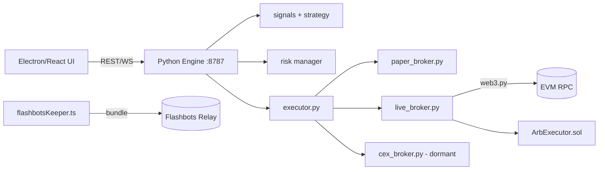
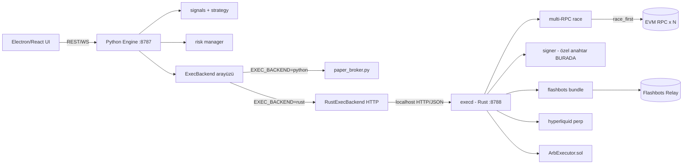
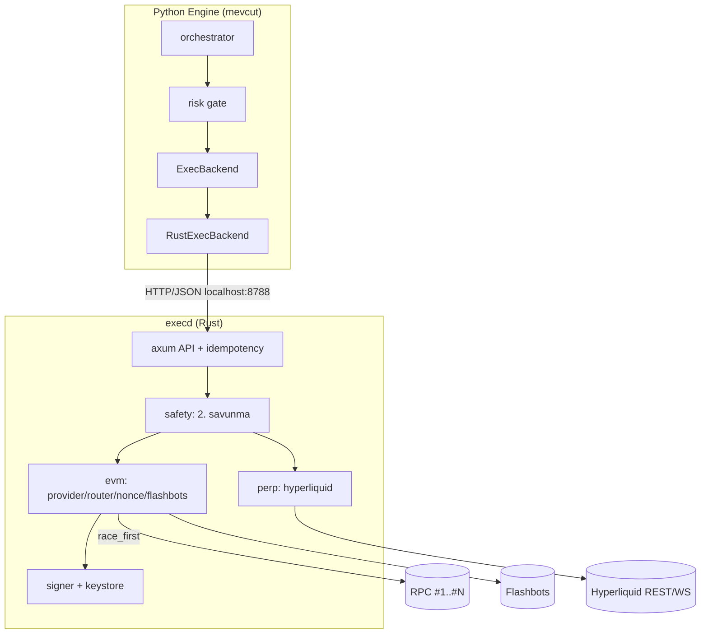
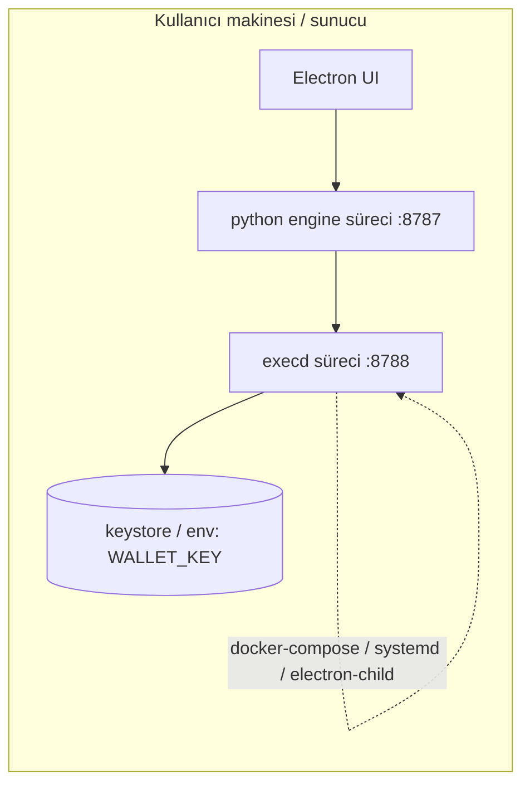
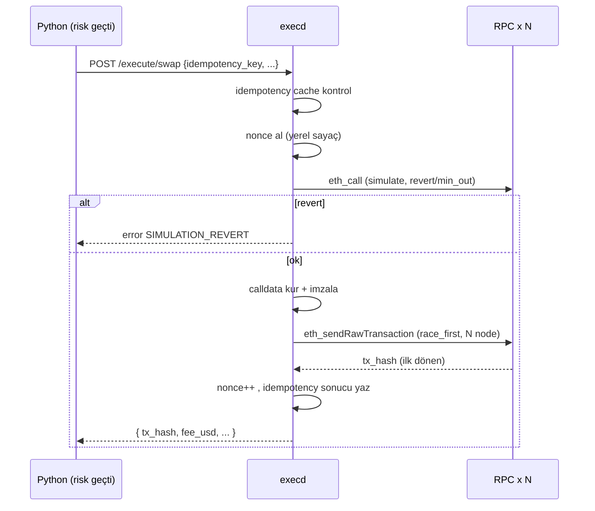
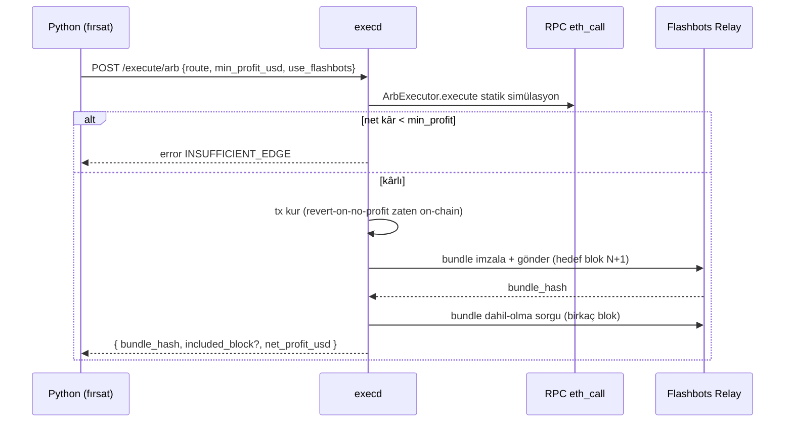
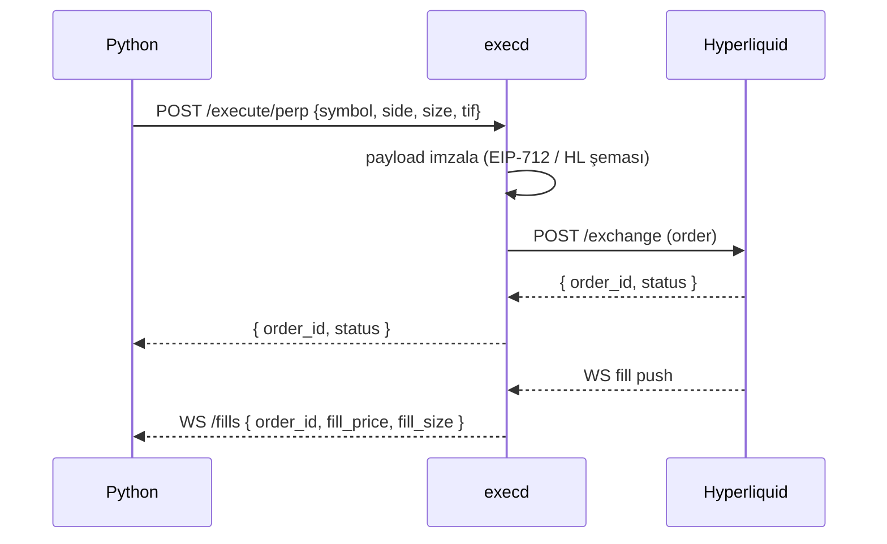
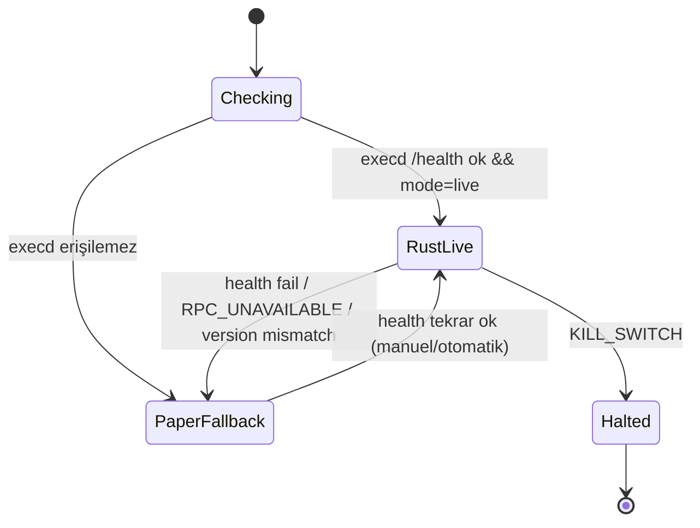

# ADR-0001: Emir-İletim Katmanını Ayrı Bir Rust Servisine Taşımak

**Durum:** Önerildi (Proposed)
**Tarih:** 2026-06-18
**Karar verenler:** mert (proje sahibi)
**Kapsam:** Tüm execution yolu — arbitraj/MEV, DEX zincir-üstü swap (live), perp/CEX (Hyperliquid)
**İlgili:** `engine/trading/*`, `src/core/keeper/flashbotsKeeper.ts`, `contracts/ArbExecutor.sol`

---

## İçindekiler
1. [Bağlam](#1-bağlam-context)
2. [Karar](#2-karar-decision)
3. [Hedefler ve Hedef-Olmayanlar](#3-hedefler-ve-hedef-olmayanlar)
4. [Gecikme Bütçesi ve Ölçüm Planı](#4-gecikme-bütçesi-ve-ölçüm-planı)
5. [Değerlendirilen Seçenekler](#5-değerlendirilen-seçenekler)
6. [Takas Analizi](#6-takas-analizi)
7. [Mimari](#7-mimari)
8. [Arayüz Sözleşmesi](#8-arayüz-sözleşmesi-api-v1)
9. [Akış Diyagramları](#9-akış-diyagramları)
10. [Rust Crate Tasarımı](#10-rust-crate-tasarımı-execd)
11. [Alt-Sistem Derinlemesine](#11-alt-sistem-derinlemesine)
12. [Python Entegrasyonu](#12-python-entegrasyonu)
13. [Yapılandırma](#13-yapılandırma-env)
14. [Gözlemlenebilirlik](#14-gözlemlenebilirlik)
15. [Test Stratejisi](#15-test-stratejisi)
16. [Güvenlik Gözden Geçirme](#16-güvenlik-gözden-geçirme-checklist)
17. [Dağıtım ve CI](#17-dağıtım-ve-ci)
18. [Geçiş / Rollout Planı](#18-geçiş--rollout-planı)
19. [Sonuçlar](#19-sonuçlar-consequences)
20. [Riskler ve Azaltımlar](#20-riskler-ve-azaltımlar)
21. [Açık Sorular](#21-açık-sorular)
22. [Eylem Maddeleri](#22-eylem-maddeleri-action-items)
23. [Ek (Appendix)](#23-ek-appendix)

---

## 1. Bağlam (Context)

`ai-trade-bot` bugün polyglot: Python çekirdek motor (sinyal/risk/strateji/paper-live broker),
TypeScript/Electron arayüz + Flashbots MEV-korumalı keeper, ve Solidity `ArbExecutor.sol`
(atomik arbitraj, revert-on-no-profit). Emir iletimi şu an üç yerde dağınık.

### Mevcut durum (current state)



**Sorun:** Execution mantığı üç dile yayılmış; live tx kurma/imzalama Python `live_broker.py`'de
(web3.py), MEV bundle TS keeper'da, atomik arbitraj on-chain'de. Tek, hızlı, denetlenebilir bir
iletim katmanı yok. Hedef: **"daha hızlı işlem alabilmek"** için emir iletimini Rust'a almak.

### Hedef durum (target state)



---

## 2. Karar (Decision)

Emir iletimini **ayrı bir Rust servisi** (`execd` — *execution daemon*) olarak inşa et.
Python motoru, _doğrulanmış_ emirleri yerel bir API üzerinden bu servise iletir. Rust servisi
EVM tarafında **alloy** (ethers-rs'in halefi), perp tarafında imzalı Hyperliquid istemcisi
kullanır. Karar/risk/strateji Python'da kalır; Rust yalnızca **iletim + imzalama + simülasyon
+ çoklu-RPC yarışı + Flashbots bundle**'dan sorumludur ("dumb but fast" executor).

Geçiş **strangler pattern** ile yapılır: Python'da `ExecBackend` arayüzü; `EXEC_BACKEND`
bayrağı `python` (mevcut) veya `rust` (yeni servis) seçer. Paper her zaman Python.

---

## 3. Hedefler ve Hedef-Olmayanlar

**Hedefler (Goals)**
- Arbitraj/MEV ve perp sıcak yolunda **deterministik, düşük (p99) gecikme**.
- Çoklu-RPC **yarışı** (ilk dönen yanıtı al) ve hızlı failover.
- Özel anahtarı **tek, izole bir süreçte** hapsetmek (Python süreci anahtarı görmez).
- Tek noktada **nonce + idempotency** ile çift/yarış işlem hatalarını yok etmek.
- Mevcut Python motoru, UI ve paper akışını **bozmamak** (aşamalı, geri alınabilir geçiş).
- `paper` modda zincire dokunmadan **simülasyon paritesi** (geliştirme/test güvenliği).

**Hedef-olmayanlar (Non-goals)**
- Sinyal/strateji/risk mantığını Rust'a taşımak (Python'da kalır — gecikme önemsiz, iterasyon hızlı).
- Genel mempool sandwich/MEV saldırısı yapmak (yalnız MEV-korumalı iletim).
- Donanım imzalayıcı/HSM (v1'de değil; arayüz buna açık bırakılır).
- CEX spot (Binance) canlı işlemi (CexBroker pasif kalır; perp önce gelir).

---

## 4. Gecikme Bütçesi ve Ölçüm Planı

### Uçtan uca gecikme dağılımı

| Bileşen | Tipik | Diller arası fark | Rust kazancı? |
|---|---|---|---|
| Karar (sinyal→emir) | 1–10 ms (Python) | Rust 10–100x ama mutlak < 10 ms | Düşük |
| Tx kurma + imzalama | 1–5 ms (Python web3) | Rust < 0.5 ms (alloy) | **Orta** (yüksek hacim) |
| Yerel IPC (Python→execd) | — | HTTP/JSON ~0.2–0.5 ms | İhmal |
| RPC gidiş-dönüş | **20–300 ms** | Ağ — dilden bağımsız | — |
| Çoklu-RPC yarışı | RTT yerine **min(RTT_i)** | Async fan-out | **Yüksek** |
| Blok süresi | ~12 s ETH / 0.25–2 s L2 | Zincir | — |
| Flashbots dahil-olma | 1+ blok | Relay/builder | — |

**Sonuç:** Tek işlem hızında Rust marjinal; asıl kazanç **(a) çoklu-RPC yarışıyla efektif RTT'yi
min(RTT)'ye indirmek, (b) imzalama/kurma yükünü mikrosaniyeye çekip yüksek-eşzamanlı arbitraj
penceresini kaçırmamak, (c) deterministik p99** (Python GC/GIL kuyruğu yok).

### Ölçüm/benchmark planı (kanıt-temelli karar)
1. **Baseline:** mevcut Python `live_broker` ile testnet'te 100 swap; `decision→tx_hash` p50/p99.
2. **execd:** aynı senaryo Rust ile; `Python.send → execd.tx_hash` p50/p99.
3. **Çoklu-RPC:** 1 RPC vs 3 RPC yarışı; efektif RTT dağılımı.
4. **Arbitraj penceresi:** fırsat tespiti→bundle gönderimi gecikmesi; dahil-olma oranı.
5. **Karar kapısı:** Faz 1 sonunda ölçüm gerçekten anlamlı bir p99 düşüşü (örn. >%30) gösteriyorsa
   Faz 2/3'e devam; göstermiyorsa kapsam yalnız arbitraj/perp ile sınırlanır.

---

## 5. Değerlendirilen Seçenekler

### Seçenek A — Ayrı Rust servisi (IPC/HTTP) **[SEÇİLEN]**

| Boyut | Değerlendirme |
|---|---|
| Karmaşıklık | Orta (yeni süreç + protokol + dağıtım) |
| Maliyet | Orta (Rust öğrenme + bakım) |
| Ölçeklenebilirlik | Yüksek (tokio async, çoklu-RPC doğal) |
| Takım aşinalığı | Düşük-orta |
| Gecikme | En iyi (sıcak yol Rust; IPC < 1 ms) |
| İzolasyon | Yüksek (çökerse Python paper'a düşer; anahtar tek süreçte) |

**Artılar:** Dil-bağımsız sözleşme; paper Python'da kalır; özel anahtar yalnız `execd`'de;
bağımsız ölçek/restart; async çoklu-RPC + Flashbots doğal.
**Eksiler:** Süreçler arası protokol + dağıtım; iki dilin CI zinciri.

### Seçenek B — PyO3 gömülü modül (maturin)

| Boyut | Değerlendirme |
|---|---|
| Gecikme | En düşük çağrı yükü (in-process) |
| İzolasyon | **Düşük** (çökerse Python'u düşürür; anahtar aynı bellekte) |
| Dağıtım | Zor (her platform wheel) |

**Artılar:** Sıfıra yakın çağrı yükü; tek süreç.
**Eksiler:** Çökme izolasyonu yok; özel anahtar Python süreciyle aynı bellekte; async köprü kırılgan.

### Seçenek C — Mevcut TS Flashbots keeper'ı genişlet (Rust yok)

**Artılar:** Yeni dil yok; Flashbots zaten TS'te; hızlı teslim.
**Eksiler:** HFT/MEV sıcak yolunda Rust kadar deterministik değil; keeper'ı headless'a taşımak yine iş.

### Seçenek D — Yalnız perp/arb için Rust, swap Python'da

**Artılar:** Kapsam küçük, en yüksek getirili yerler. **Eksiler:** İki execution yolu (tutarsızlık),
anahtar iki yerde. (Kullanıcı tam katmanı seçti — bu seçenek elendi.)

---

## 6. Takas Analizi

- **Gecikme vs. karmaşıklık:** Ölçülebilir kazanç arbitraj/MEV + perp'te. Tüm execution'ı taşımak
  tek tutarlı katman + anahtar izolasyonu verir; swap/paper kazancı marjinal ama bütünlük değerli.
- **İzolasyon vs. çağrı yükü:** Ayrı süreç (A) ~sub-ms IPC ekler ama çökme izolasyonu + anahtar
  güvenliği sağlar; bir trade botunda anahtar izolasyonu çağrı yükünden değerli, IPC yükü RPC RTT
  yanında ölçülemez. → A, B'ye tercih edilir.
- **Teslim hızı:** C en hızlı ama Rust hız hedefinin altında.

**Gerekçe:** Seçenek A, gecikme hedefini karşılar, özel anahtarı sıkı izole eder, Python/UI'ı bozmaz.

### Transport (A içinde)
- **v1: localhost HTTP + JSON (axum)** — en basit, debug kolay, FastAPI alışkanlığıyla uyumlu.
- **v2 (profil gösterirse): gRPC (tonic)** veya **Unix-domain-socket / Windows named-pipe** —
  tipli sözleşme + daha düşük yük. Yalnız ölçüm gerektiriyorsa.
- Perp dolum akışı için **WebSocket** (sunucu→Python push).

---

## 7. Mimari

### Bileşen görünümü



### Dağıtım görünümü



- `execd` ayrı OS süreci; Electron ile veya `docker-compose` ile başlatılır (engine gibi).
- Yalnız `127.0.0.1`'e bağlanır (dışarı açık değil); opsiyonel paylaşılan-secret header.

---

## 8. Arayüz Sözleşmesi (API v1)

`execd` `127.0.0.1:8788`'de dinler; Python `EXECD_URL` ile bağlanır. Tüm yanıtlar zarflıdır:
`{ "ok": bool, "data": {...}, "error": { "code": str, "message": str } }`. Her mutasyon isteği
`idempotency_key` (UUID) taşır.

```
GET  /health
  -> { ok, data: { status, version, mode, signer_loaded,
                   chains: { "1": {connected, latest_block, nonce}, ... } } }

POST /simulate
  { chainId, to, data, value, from }
  -> { ok, data: { gas_estimate, will_revert, revert_reason? } }

POST /execute/swap
  { idempotency_key, chainId, dex, token_in, token_out, amount_in,
    min_out, deadline_s, recipient, mode }            # mode: "paper"|"live"
  -> { ok, data: { tx_hash, effective_price, gas_used, fee_usd, nonce } }

POST /execute/arb
  { idempotency_key, chainId, route: [...], min_profit_usd,
    use_flashbots, mode }
  -> { ok, data: { tx_hash?|bundle_hash?, net_profit_usd, included_block?, simulated_only? } }

POST /execute/perp
  { idempotency_key, venue:"hyperliquid", symbol, side, size,
    price?, reduce_only, tif:"Gtc"|"Ioc"|"Alo", mode }
  -> { ok, data: { order_id, status, fill_price?, fill_size? } }

POST /cancel
  { venue, order_id } -> { ok }

GET  /nonce/{chainId}  -> { ok, data: { nonce } }
GET  /metrics          -> Prometheus metinleri
WS   /fills            -> sunucu push: { order_id, symbol, side, price, size, ts }
```

### Hata modeli (error codes)

| code | Anlam | Python davranışı |
|---|---|---|
| `VALIDATION` | Eksik/geçersiz alan | Hata logla, işlemi atla |
| `SIMULATION_REVERT` | Simülasyon revert verdi | İşlem açma; gerekçe kaydet |
| `INSUFFICIENT_EDGE` | min_profit/min_out karşılanmadı | İşlem açma |
| `GAS_CAP` | Gas tavanı aşıldı | Bekle/atla |
| `NONCE_CONFLICT` | Nonce yarışı | execd otomatik yeniden dener; Python beklemez |
| `RPC_UNAVAILABLE` | Tüm RPC'ler düştü | Fail-safe: live durdur, kullanıcıya bildir |
| `KILL_SWITCH` | Günlük zarar limiti | Tüm live emirler reddedilir |
| `DUPLICATE` | Aynı idempotency_key | Önceki sonucu döndür (yan etki yok) |

### Sözleşme sürümleme
- Tek kaynak: `contracts/execd.openapi.yaml` (veya JSON-schema). Python tipleri ve Rust `serde`
  struct'ları **bu sözleşmeden üretilir** (mevcut `scripts/gen_types.py` felsefesi). Drift testi CI'da.
- `GET /health.version` semver; Python uyumsuz major'da fail-safe.

---

## 9. Akış Diyagramları

### 9.1 DEX swap (live)



### 9.2 Atomik arbitraj + Flashbots



### 9.3 Perp (Hyperliquid)



---

## 10. Rust Crate Tasarımı (`execd`)

```
execd/
  Cargo.toml
  src/
    main.rs            # axum sunucu + config + signer + tracing
    config.rs          # env: EXECD_PORT, RPC_*, WALLET_KEY(yalnız burada), CHAINS, MAX_GAS_GWEI
    state.rs           # AppState: providers, signer, nonce_mgr, idempo cache, safety
    api/
      mod.rs           # router
      health.rs  swap.rs  arb.rs  perp.rs  simulate.rs  cancel.rs
    evm/
      provider.rs      # çoklu-RPC + race_first + failover
      router.rs        # uniswap v2/v3 calldata
      nonce.rs         # zincir başına nonce sahibi (Mutex<HashMap>)
      flashbots.rs     # bundle kurma + imzalama + gönderme
      abi.rs           # ArbExecutor + Router ABI (alloy sol! makrosu)
    perp/
      hyperliquid.rs   # imzalama + REST + WS
    safety.rs          # min_out, gas tavanı, kill-switch, idempotency
    types.rs           # serde istek/yanıt (OpenAPI'den üretilir)
    error.rs           # ExecError -> hata kodu eşleme
  tests/
    swap_anvil.rs  arb_anvil.rs  perp_mock.rs
```

### `Cargo.toml` (özet)

```toml
[package]
name = "execd"
version = "0.1.0"
edition = "2021"

[dependencies]
alloy = { version = "0.x", features = ["full", "signer-local", "rpc-types", "providers"] }
tokio = { version = "1", features = ["full"] }
axum = "0.7"
serde = { version = "1", features = ["derive"] }
serde_json = "1"
reqwest = { version = "0.12", features = ["json", "rustls-tls"] }
tokio-tungstenite = "0.23"   # perp WS
tracing = "0.1"
tracing-subscriber = { version = "0.3", features = ["env-filter", "json"] }
dotenvy = "0.15"
uuid = { version = "1", features = ["v4"] }
thiserror = "1"
dashmap = "6"                # eşzamanlı idempotency/nonce
```

### `main.rs` (iskelet)

```rust
#[tokio::main]
async fn main() -> anyhow::Result<()> {
    init_tracing();
    let cfg = Config::from_env()?;                 // WALLET_KEY yalnız burada okunur
    let state = AppState::init(cfg).await?;         // provider'lar + signer + nonce mutabakatı
    let app = api::router(state);
    let addr = "127.0.0.1:8788".parse()?;           // yalnız localhost
    tracing::info!(%addr, "execd başladı");
    axum::serve(tokio::net::TcpListener::bind(addr).await?, app).await?;
    Ok(())
}
```

### `/execute/swap` (iskelet)

```rust
async fn execute_swap(
    State(st): State<AppState>,
    Json(req): Json<SwapRequest>,
) -> Result<Json<Envelope<SwapResult>>, ExecError> {
    // 0) idempotency: aynı anahtar görülmüşse önceki sonucu döndür
    if let Some(prev) = st.idempo.get(&req.idempotency_key) { return Ok(Json(prev)); }

    // 1) ikinci savunma kapıları (Python'a ek)
    st.safety.check_gas_cap(req.chain_id).await?;
    st.safety.check_kill_switch()?;

    // 2) paper modda zincire dokunma — simüle et
    if req.mode == Mode::Paper {
        let sim = st.evm.simulate_swap(&req).await?;
        return finish(&st, &req.idempotency_key, SwapResult::paper(sim));
    }

    // 3) nonce + simülasyon + imzala + çoklu-RPC yarışı
    let nonce = st.nonce.next(req.chain_id).await?;
    let tx = st.evm.build_swap_tx(&req, nonce).await?;
    st.evm.simulate(&tx).await?;                    // revert/min_out
    let signed = st.signer.sign(tx).await?;
    let tx_hash = st.evm.send_race(req.chain_id, signed).await?;  // ilk dönen
    st.nonce.commit(req.chain_id);
    finish(&st, &req.idempotency_key, SwapResult::live(tx_hash, ...))
}
```

---

## 11. Alt-Sistem Derinlemesine

### 11.1 Çoklu-RPC yarışı (`evm/provider.rs`)
- Her zincir için **N provider** (`.env`'deki virgüllü RPC listesi + public yedekler — mevcut
  Python `provider.py` mantığının Rust karşılığı).
- `send_race`: aynı imzalı tx'i N node'a aynı anda `eth_sendRawTransaction`; **ilk başarılı**
  yanıtı döndür, diğerlerini iptal et (`tokio::select!` / `FuturesUnordered`).
- Okuma (gas, nonce, call) için **en hızlı/sağlıklı** provider; arızada otomatik dışla + yeniden dahil.
- Sağlık: periyodik `eth_blockNumber` ile gecikme/erişilebilirlik takibi (EWMA).

### 11.2 Nonce yöneticisi (`evm/nonce.rs`)
- Zincir başına **tek otorite**: başlangıçta `eth_getTransactionCount(pending)` ile mutabakat,
  sonra yerel monoton sayaç. `next()` rezerve eder, `commit()` ilerletir, hata olursa `release()`.
- Yarış/çift-nonce imkânsız (tek süreç + mutex). "stuck tx" için gas-bump/yeniden gönderim politikası.

### 11.3 Idempotency cache (`safety.rs`)
- `DashMap<idempotency_key, CachedResult>` + TTL (örn. 10 dk). Python retry'leri çift işlem üretmez.
- Anahtar Python tarafında üretilir (her mantıksal emir için bir kez), retry'de aynı kalır.

### 11.4 İkinci-savunma kapıları (`safety.rs`)
Python risk kapılarını geçen emir bile burada tekrar denetlenir (defense-in-depth):
`min_out`/`min_profit`, **gas tavanı** (anlık gwei), **kill-switch** (günlük zarar bayrağı,
Python `/health`'ten senkronize), **simülasyon-önce-gönder**, `mode==paper → no chain write`.

### 11.5 Signer & anahtar yönetimi (`evm/signer.rs`) — **kritik**
- Özel anahtar **yalnız `execd` sürecinde**; Python asla görmez/iletmez.
- Kaynak seçenekleri: (a) `WALLET_KEY` env (burner cüzdan, en basit), (b) şifreli **keystore JSON**
  + başlangıçta parola (env/promt), (c) gelecekte harici imzalayıcı/HSM (arayüz açık bırakılır).
- **Tehdit modeli:**

| Tehdit | Azaltım |
|---|---|
| Python süreci ele geçirilir | Anahtar orada yok; en fazla `execd`'ye emir yollar (idempotency + kapılar sınırlar) |
| `execd` belleği dump | Anahtar bellekte; izole süreç + en az yetki + `zeroize` crate ile temizleme |
| Disk'te düz anahtar | Keystore (şifreli) öner; `.env` git-ignore; dosya izinleri 600 |
| Yetkisiz yerel çağrı | Yalnız `127.0.0.1` + opsiyonel paylaşılan-secret header |

### 11.6 Flashbots (`evm/flashbots.rs`)
- Bundle: `[arb_tx]` (gerekirse `[bribe_tx]`); hedef blok `N+1..N+k`; bundle imzalama (ayrı kimlik
  anahtarı). `eth_sendBundle` + `flashbots_getBundleStats` ile dahil-olma izleme.
- `ArbExecutor.sol` zaten **revert-on-no-profit**; execd ek olarak `eth_callBundle` ile ön-simülasyon.

### 11.7 Hyperliquid perp (`perp/hyperliquid.rs`)
- İmzalı emir (HL şeması/EIP-712); REST `POST /exchange`; WS `subscribe userFills` → `/fills` push.
- `reduce_only`, `tif`, `Ioc/Alo`; iptal; pozisyon/funding sorgu (read).

---

## 12. Python Entegrasyonu

### `ExecBackend` protokolü (`engine/trading/exec_backend.py`)

```python
from typing import Protocol
from engine.models import TradeOrder

class ExecBackend(Protocol):
    name: str
    def execute_swap(self, order: TradeOrder, *, min_out: float, deadline_s: int) -> TradeOrder: ...
    def execute_arb(self, opp, *, min_profit_usd: float, use_flashbots: bool) -> dict: ...
    def execute_perp(self, *, symbol: str, side: str, size: float, **kw) -> dict: ...
    def health(self) -> dict: ...
```

- `PythonExecBackend` → mevcut `live_broker` / `paper_broker` (değişmez, varsayılan).
- `RustExecBackend` → `httpx` ile `execd`'ye çağrı; her çağrıda `idempotency_key=uuid4()`.
- `executor.py`: `EXEC_BACKEND` env'ine göre backend seçer. **Paper her zaman Python.**

### Fail-safe durum makinesi



- `execd` yoksa/sağlıksızsa **live emir GİTMEZ**; sistem paper'a düşer + UI'da uyarı.
- Sürüm uyuşmazlığında (sözleşme major) live durur.

---

## 13. Yapılandırma (env)

| Değişken | Yer | Açıklama |
|---|---|---|
| `EXEC_BACKEND` | Python | `python` (vars.) \| `rust` |
| `EXECD_URL` | Python | `http://127.0.0.1:8788` |
| `EXECD_SHARED_SECRET` | her iki | Yerel çağrı doğrulama header'ı (ops.) |
| `EXECD_PORT` | execd | dinleme portu |
| `RPC_ETHEREUM` … | execd | zincir başına virgüllü RPC listesi |
| `WALLET_KEY` | **execd** | özel anahtar — **yalnız execd**, Python'da YOK |
| `WALLET_KEYSTORE` / `WALLET_KEYSTORE_PASS` | execd | alternatif: şifreli keystore |
| `FLASHBOTS_SIGNER_KEY` | execd | bundle kimlik anahtarı (cüzdandan ayrı) |
| `MAX_GAS_GWEI` | execd | ikinci-savunma gas tavanı |
| `HYPERLIQUID_KEY` | execd | perp imzalama |
| `EXECD_MODE` | execd | `paper`\|`live` (Python'la senkron) |

> Güvenlik: `.env` git-ignore'da; live anahtarlar yalnız `execd`'nin ortamında. Burner cüzdan kullan.

---

## 14. Gözlemlenebilirlik

- **Tracing:** her istek `idempotency_key`/`trace_id` ile span; Python log'larıyla korelasyon
  (Python aynı id'yi header'da gönderir). JSON log → mevcut `engine/util/logging.py` ile aynı hat.
- **Metrics (`/metrics`):** `execd_swap_latency_ms` (histogram), `execd_rpc_race_winner`,
  `execd_send_errors_total{code}`, `execd_nonce_conflicts_total`, `execd_bundle_included_total`,
  `execd_perp_fill_latency_ms`.
- **/health detay:** zincir bağlantıları, son blok, nonce, signer yüklü mü, mode. Python `/health`
  bunu birleştirir (mevcut health endpoint genişler).

---

## 15. Test Stratejisi

| Katman | Araç | Kapsam |
|---|---|---|
| Rust birim | `cargo test` | calldata kurma, nonce mantığı, safety kapıları, idempotency, hata eşleme |
| Rust entegrasyon | **anvil/foundry fork** | gerçek-benzeri swap/arb; revert senaryoları; race_first |
| Perp | mock HL sunucu | imzalama doğrulama, WS fill akışı |
| Sözleşme (contract) | Python `pytest` + `execd` (paper) | `/execute/*` şekil/anlam paritesi; OpenAPI drift |
| Fail-safe | kaos | execd öldür → Python paper'a düşüyor mu; RPC düşür → failover |
| Uçtan uca | testnet (Sepolia/Arbitrum-Sepolia) | gerçek tx, küçük tutar, p50/p99 ölçüm |

- CI: `cargo build/test` + `cargo clippy` + Python sözleşme testi (execd paper modda ayağa kalkar).

---

## 16. Güvenlik Gözden Geçirme (checklist)

- [ ] Özel anahtar Python sürecine **hiç** girmiyor (kod taraması + log redaksiyonu).
- [ ] `execd` yalnız `127.0.0.1`; opsiyonel shared-secret; dış arayüz yok.
- [ ] Tüm live tx **simülasyon-önce-gönder**; `min_out`/`min_profit` ikinci savunma.
- [ ] `idempotency_key` çift gönderimi engelliyor; nonce tek otorite.
- [ ] Kill-switch (günlük zarar) execd tarafında da uygulanıyor.
- [ ] Keystore şifreli; `.env` git-ignore; dosya izinleri kısıtlı; `zeroize` ile bellek temizliği.
- [ ] Bundle kimlik anahtarı cüzdan anahtarından ayrı.
- [ ] Bağımlılık denetimi: `cargo audit`; sürüm sabitleme.
- [ ] Live'a geçiş `assert_live_ready` + paper→live terfi kriterleri (mevcut `edge_gate`) ile kapılı.

---

## 17. Dağıtım ve CI

- **Geliştirme:** `cargo run` (execd) + `uvicorn` (engine) + `npm run dev` (UI). `Makefile`'a
  `make execd` hedefi.
- **Docker:** `Dockerfile.execd` (rust:slim → distroless) + `docker-compose.yml`'a `execd` servisi
  (engine'in yanında, `depends_on` + healthcheck).
- **Electron:** isteğe bağlı `execd`'yi child-process olarak başlat (engine gibi `AUTO_START`).
- **CI matris:** `windows-latest`, `macos-latest`, `ubuntu-latest` için `cargo build --release`;
  artefakt olarak önceden derlenmiş ikili (electron-builder `extraResources`'a eklenir).
- **Çapraz-derleme:** macOS evrensel (`aarch64` + `x86_64`); Windows MSVC.

---

## 18. Geçiş / Rollout Planı

1. **Gölge (shadow) mod:** `EXEC_BACKEND=python` kalır; `execd` paralel olarak **paper/simulate**
   çağrılır, sonuçlar Python ile kıyaslanır (fonksiyonel parite + gecikme).
2. **Canary (testnet):** `EXEC_BACKEND=rust`, küçük tutar, tek zincir (Arbitrum-Sepolia).
3. **Kademeli live:** önce tek zincir + düşük limit; metrikler iyi ise diğer zincirler.
4. **Geri alma (rollback):** tek env değişikliği (`EXEC_BACKEND=python`) — anında eski yola dön.
5. **Arbitraj/perp** yalnız parite + gecikme kanıtı sonrası live.

---

## 19. Sonuçlar (Consequences)

**Kolaylaşan:** arbitraj/MEV + perp sıcak yolunda deterministik düşük gecikme + çoklu-RPC yarışı;
özel anahtar tek izole süreçte (saldırı yüzeyi daralır); nonce/tx tek otorite; execution headless
(docker/sunucu) çalışır; UI'dan bağımsız.

**Zorlaşan:** iki dilin derleme/CI/dağıtım zinciri (Rust toolchain + cross-compile); sözleşme
sürümleme + tip drift yönetimi; iki süreç için gözlemlenebilirlik/restart politikası.

**Tekrar gözden geçirilecek:** v1 HTTP+JSON yeterli mi yoksa gRPC/UDS mı (gecikme profili sonrası);
anahtar yönetimi (env/keystore/HSM); Flashbots dışı MEV koruması (L2 sıralayıcı, özel mempool).

---

## 20. Riskler ve Azaltımlar

| Risk | Etki | Azaltım |
|---|---|---|
| `execd` çökmesi/erişilemez | Live emir gidemez | Python health-check → fail-safe: live durdur, paper'a düş, UI uyarısı |
| Özel anahtar sızıntısı | Fon kaybı | Anahtar yalnız execd; burner cüzdan; keystore; zeroize; en az yetki |
| Çift gönderim (retry) | Çift işlem | `idempotency_key` + dedupe cache + nonce sahipliği |
| Python↔Rust tip drift | Sessiz hata | Tek OpenAPI sözleşmesinden iki taraf üretimi + CI drift testi |
| Simülasyonsuz gönderim | Reverted tx + gas | Her live tx öncesi `eth_call`; revert-on-no-profit |
| Nonce sıkışması | Bekleyen tx | Gas-bump/yeniden gönderim; tek nonce otoritesi |
| Çapraz-platform derleme | Dağıtım engeli | CI matris + önceden derlenmiş ikili + docker (linux) |
| Rust öğrenme eğrisi | Yavaş ilerleme | Faz 1 küçük tutulur; kapsam ölçümle genişler |
| Gecikme kazancı beklenenden az | Boşa yatırım | **Faz 1 sonunda benchmark kapısı**: >%X p99 düşüşü yoksa kapsamı arb/perp ile sınırla |

---

## 21. Açık Sorular

1. Anahtar kaynağı: burner `WALLET_KEY` env ile mi başlayalım, yoksa baştan şifreli keystore mı?
2. Transport: v1 HTTP+JSON kabul mü, yoksa baştan gRPC mi (ekstra kurulum)?
3. `execd` nasıl başlasın: docker-compose mu, Electron child-process mu, ikisi de mi?
4. Flashbots dışında L2'lerde (Arbitrum/Base) özel sıralayıcı/MEV koruması gerekli mi?
5. Hyperliquid için resmi/community Rust SDK mı, elle imzalama mı?

---

## 22. Eylem Maddeleri (Action Items)

**Faz 0 — İskele & sözleşme** *(kabul: execd /health döner, Python fail-safe çalışır)*
1. [ ] `execd/` crate iskelesi (axum + /health + config + signer yükleme + tracing)
2. [ ] `contracts/execd.openapi.yaml` sözleşmesi; Python `ExecBackend` + `RustExecBackend` stub
3. [ ] `EXEC_BACKEND` bayrağı + fail-safe durum makinesi + sözleşme drift testi (CI)

**Faz 1 — DEX swap** *(kabul: testnet'te swap p50/p99 ölçüldü, paper-parite geçti)*
4. [ ] `evm/provider.rs` çoklu-RPC race + failover; `evm/nonce.rs`
5. [ ] `evm/router.rs` v2/v3 calldata; `/simulate` + `/execute/swap`
6. [ ] anvil entegrasyon + Python sözleşme testleri + **benchmark kapısı**

**Faz 2 — Arbitraj/MEV** *(kabul: bundle dahil-olma + net kâr doğrulandı)*
7. [ ] `evm/flashbots.rs` bundle; `/execute/arb` → `ArbExecutor.sol`; ön-simülasyon
8. [ ] revert-on-no-profit + min_profit ikinci savunma; dahil-olma izleme/metrik

**Faz 3 — Perp/CEX** *(kabul: imzalı emir + WS fill akışı çalışıyor)*
9. [ ] `perp/hyperliquid.rs` imzalama + REST/WS; `/execute/perp` + `/fills` + `/cancel`

**Faz 4 — Üretim** *(kabul: güvenlik review geçti, CI matris yeşil)*
10. [ ] Gözlemlenebilirlik (tracing korelasyon, /metrics, restart), /health birleşik
11. [ ] Gecikme profili → HTTP yeterli mi? gerekirse gRPC/UDS (v2)
12. [ ] Güvenlik review checklist + docker-compose/electron başlatma + cross-compile CI

**Önerilen başlangıç:** Faz 0 + Faz 1 (paper-parity, gerçek para yok) → benchmark kapısı → Faz 2.

---

## 23. Ek (Appendix)

### A. Örnek istek/yanıt

```jsonc
// POST /execute/swap
{
  "idempotency_key": "b2f1c0e4-...-9a",
  "chainId": 42161,
  "dex": "uniswap-v3",
  "token_in": "0x...USDC",
  "token_out": "0x...WETH",
  "amount_in": "1000000000",        // 1000 USDC (6 decimals), string (bigint güvenliği)
  "min_out": "298500000000000000",  // 0.2985 WETH (slippage düşülmüş)
  "deadline_s": 60,
  "recipient": "0x...wallet",
  "mode": "live"
}
// 200
{ "ok": true, "data": {
    "tx_hash": "0xabc...", "effective_price": 3350.12,
    "gas_used": 142000, "fee_usd": 0.42, "nonce": 57 } }
```

```jsonc
// Hata
{ "ok": false, "error": { "code": "SIMULATION_REVERT",
    "message": "UniswapV3: STF (insufficient output)" } }
```

### B. Hata kodu → Python eylem hızlı tablosu
`VALIDATION/SIMULATION_REVERT/INSUFFICIENT_EDGE/GAS_CAP` → işlemi atla, logla.
`NONCE_CONFLICT/DUPLICATE` → execd halleder, Python bekler/sonucu alır.
`RPC_UNAVAILABLE/version mismatch` → fail-safe (live durdur, paper).
`KILL_SWITCH` → tüm live reddet.

### C. Sözlük
- **race_first:** Aynı isteği N kaynağa gönderip ilk başarılı yanıtı kullanma.
- **idempotency_key:** Bir mantıksal emrin tekilliğini sağlayan anahtar; retry'de aynı kalır.
- **revert-on-no-profit:** Kâr yoksa işlemi zincirde geri alan on-chain koruma (`ArbExecutor.sol`).
- **strangler pattern:** Eski sistemi bayrakla yanına yeni yol koyup kademeli devralma.
- **defense-in-depth:** Aynı kuralı birden çok katmanda (Python + execd + on-chain) uygulama.

### D. Bağımlılık notları
- **alloy** (ethers-rs halefi) aktif geliştiriliyor; sürüm sabitle, `cargo audit` çalıştır.
- Hyperliquid imzalama şeması değişebilir; `perp/hyperliquid.rs` izole tutulup sözleşme testiyle korunur.
```
